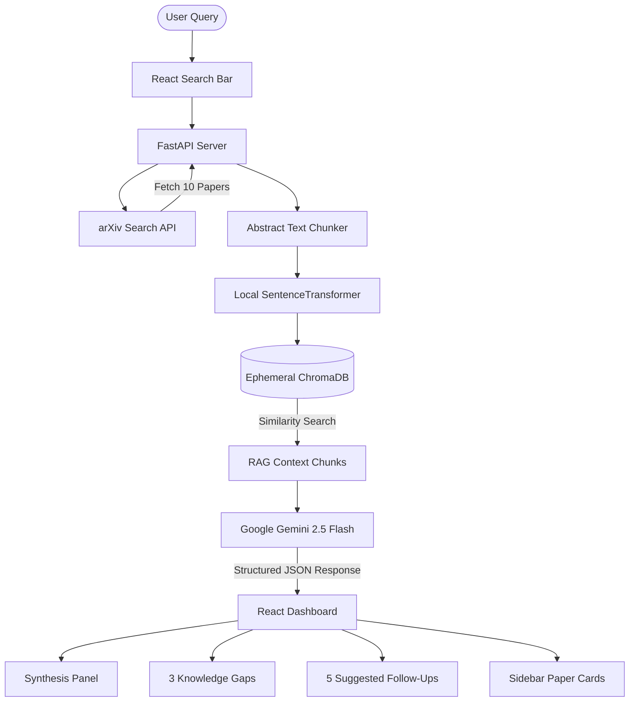

# ScholarMind — AI-powered Student Research Assistant

🚀 **Live Demo**: [https://scholarmind-app.vercel.app](https://scholarmind-app.vercel.app)

ScholarMind is a full-stack academic assistant designed for students to research topics efficiently. By feeding search terms into the arXiv API, indexing abstracts dynamically using Gemini vector embeddings, and conducting Retrieval-Augmented Generation (RAG) using Google Gemini 2.5 Flash, it synthesizes summaries, exposes critical knowledge gaps, and proposes follow-up paths.

## Key Features
- **Semantic RAG Search**: Queries the free arXiv API, chunks papers, and indexes abstracts dynamically into ChromaDB.
- **Gemini Embeddings**: Integrates the Google Gemini Embedding API (`models/gemini-embedding-001`) to compute vector representations in the cloud. This bypasses the local loading of heavy PyTorch model weights, minimizing memory usage to comfortably fit on free 512MB hosting plans.
- **Academic Synthesis**: Leverages `gemini-2.5-flash` with Structured Outputs to guarantee structured JSON metadata containing:
  - An academic yet accessible summary answering the topic.
  - Exactly **3 key knowledge gaps** identified in the literature.
  - Exactly **5 follow-up questions** to guide further research.
- **Interactive UI**: A sleek, dark dashboard designed with Tailwind CSS, featuring active suggested search tags and a scrollable sidebar of source publications.

---

## Architecture Overview



---

## Setup Instructions

### Prerequisites
- Python 3.9+
- Node.js 18+
- A Google Gemini API Key

---

### 1. Backend Setup

1. Navigate to the backend directory:
   ```bash
   cd backend
   ```
2. Create and activate a Python virtual environment:
   ```bash
   python3 -m venv venv
   source venv/bin/activate  # On Windows: venv\Scripts\activate
   ```
3. Upgrade pip and install dependencies:
   ```bash
   pip install --upgrade pip
   pip install -r requirements.txt
   ```
4. Copy the environment template and configure your API key:
   ```bash
   cp .env.example .env
   ```
   Open the `.env` file and insert your API key:
   ```env
   GEMINI_API_KEY=your_actual_gemini_api_key_here
   ```
5. Start the FastAPI development server:
   ```bash
   python main.py
   ```
   The backend server will run at `http://127.0.0.1:8000`.

---

### 2. Frontend Setup

1. Navigate to the frontend directory:
   ```bash
   cd ../frontend
   ```
2. Install the node packages:
   ```bash
   npm install
   ```
3. Start the Vite React development server:
   ```bash
   npm run dev
   ```
   The application UI will run at `http://localhost:5173`. Open this URL in your web browser.

---

## Built with Google Antigravity

This application was completely built and verified using **Google Antigravity**, an agentic AI coding companion developed by the Google DeepMind team. 

Antigravity coordinated:
- Scaffolding the backend FastAPI models, local text embedder integration, ChromaDB memory storage, and Gemini API schemas.
- Configuring the React frontend framework with Tailwind CSS and developing modular components (`SearchBar`, `LoadingSpinner`, `PaperCard`, `SummaryPanel`).
- Testing API response integration and browser DOM components to ensure high quality error feedback and a seamless RAG experience.
